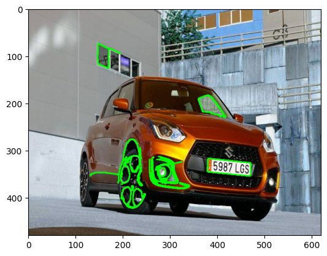
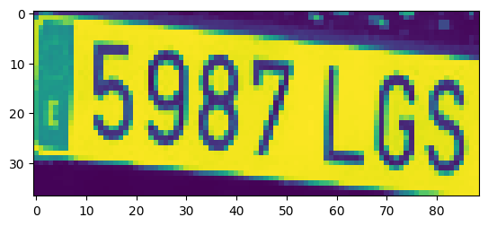
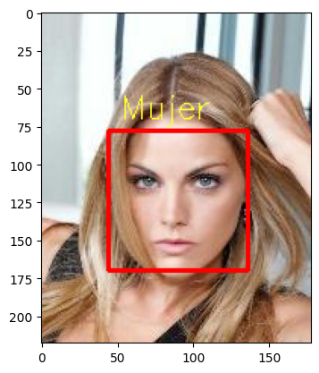
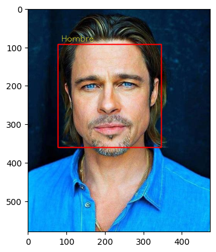
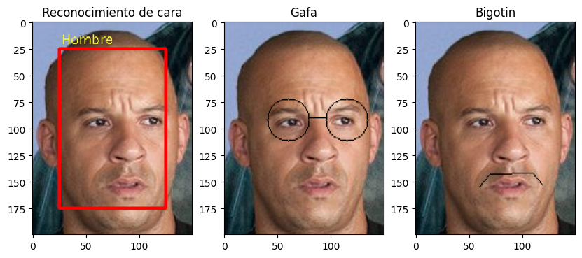

# Taller de OpenCV: Detección de Matrículas, Predicción de Género y Procesamiento de Imágenes

 
  
¡Bienvenido al taller de OpenCV! En este taller, exploraremos diversas aplicaciones de OpenCV, una poderosa biblioteca de visión por computadora. Durante el taller, abordaremos tres áreas emocionantes: Detección de Matrículas, Modelo de Predicción de Género y Procesamiento de Imágenes. Estos temas proporcionarán una comprensión práctica de cómo OpenCV puede aplicarse en situaciones del mundo real.

Contenido del Taller
1. Detección de Matrículas
En esta sección, aprenderemos a utilizar OpenCV para detectar matrículas en imágenes. Exploraremos técnicas de procesamiento de imágenes, contornos y máscaras para identificar y extraer áreas específicas de interés. Además, utilizaremos la biblioteca EasyOCR para realizar reconocimiento óptico de caracteres (OCR) y extraer información de texto de las matrículas detectadas.  
 

2. Modelo de Predicción de Género
En esta parte del taller, nos sumergiremos en el desarrollo de un modelo de predicción de género utilizando OpenCV. Exploraremos la detección facial y aprenderemos a entrenar un modelo para predecir si una cara pertenece a un hombre o una mujer. Utilizaremos técnicas de aprendizaje automático para crear y evaluar nuestro modelo.  
 
   

3. Procesamiento de Imágenes
La última sección del taller se centrará en técnicas avanzadas de procesamiento de imágenes con OpenCV. Exploraremos filtros, transformaciones geométricas y otras operaciones para manipular y mejorar imágenes.   
  

Contenido de las Carpetas
notebooks: Contiene archivos Jupyter Notebooks que proporcionan una guía paso a paso y explicaciones detalladas para cada sección del proyecto.
img: Almacena imágenes utilizadas en el proyecto, como ejemplos de matrículas, rostros para la predicción de género, etc.
model: Guarda modelos entrenados, ya sea para la detección de matrículas o para el modelo de predicción de género.
src: Contiene scripts de código fuente utilizados en el proyecto, como scripts de detección de matrículas, entrenamiento de modelos, etc.
video: Incluye archivos de video utilizados en el proyecto, como videos de prueba para la detección de matrículas.
xml: Contiene archivos XML que pueden ser utilizados para almacenar información estructurada, como configuraciones de detección.

Instrucciones para el Taller
* Clona o descarga este repositorio en tu máquina local.
* Abre Jupyter Notebook o cualquier entorno de desarrollo que prefieras.
* Explora los archivos del taller en la carpeta "src".
* Sigue las instrucciones y comentarios en el código para cada sección.
* ¡Diviértete explorando OpenCV y sus aplicaciones prácticas!

